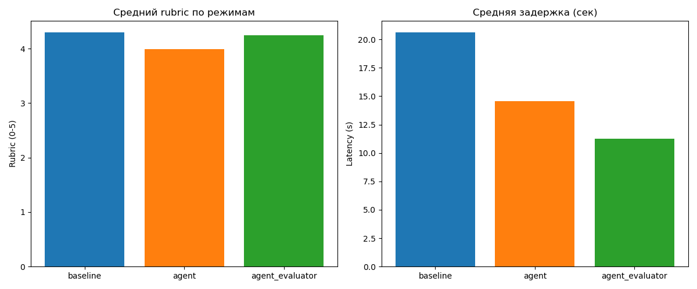
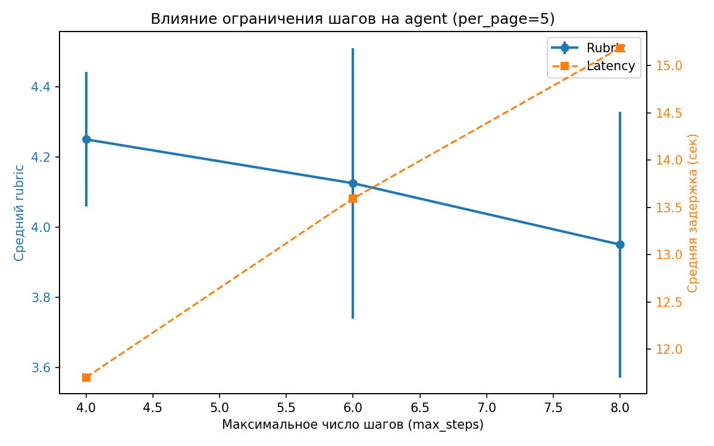
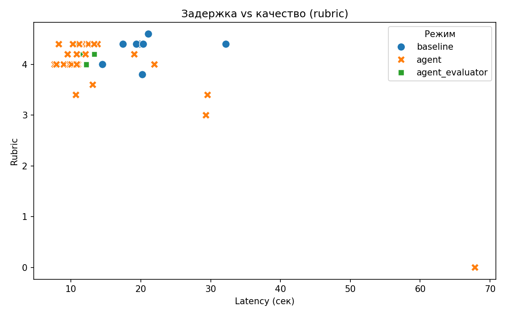
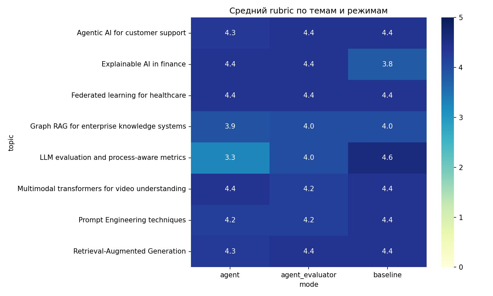
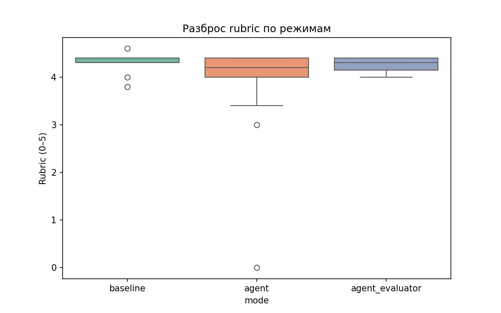
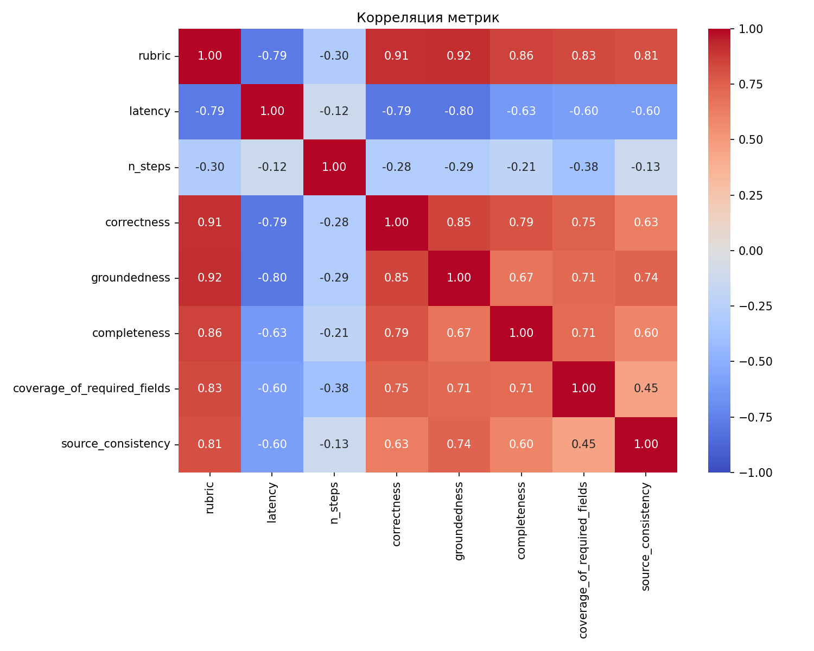
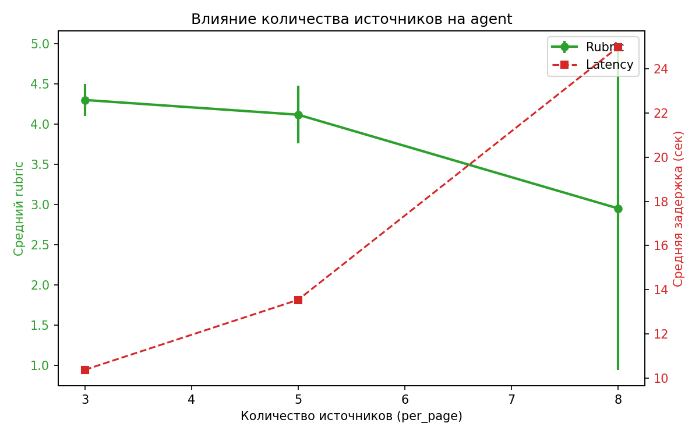

# Лабораторная работа: Агентный искусственный интеллект

## Сравнительный анализ Baseline, Agent и Agent+Evaluator для генерации научно-аналитических обзоров

---

# Теоретическая часть

## 1. Понятие агентной системы и её отличие от обычного LLM-приложения

**Агентная система** — это программный комплекс, который решает задачу не за один вызов языковой модели, а как **последовательность шагов** (цикл «восприятие → действие»). Ключевые признаки агента:

- **Состояние (State)** — структура данных, хранящая цель, историю действий, найденные источники и промежуточные результаты. Состояние обновляется после каждого шага и определяет дальнейший маршрут.
- **Инструменты (Tools)** — внешние функции или API, которые агент вызывает для получения информации: поиск в Wikipedia, поиск публикаций в OpenAlex, извлечение аннотаций, обработка текста.
- **Критерий остановки (Stop Condition)** — явное правило, по которому агент завершает работу: достигнут лимит шагов, сгенерирован финальный ответ, произошла критическая ошибка.

**Отличие от обычного LLM-приложения (baseline):**

| Характеристика | Baseline | Agent |
|----------------|----------|-------|
| Число вызовов LLM | 1 | 1 (для генерации) + возможно дополнительные |
| Хранение состояния | Нет | Да, AgentState |
| Использование инструментов | Один вызов поиска перед генерацией | Последовательные вызовы с сохранением результатов |
| Трассировка | Только логирование событий | Полная история шагов с аргументами и результатами |
| Реакция на промежуточные результаты | Отсутствует | Может переформулировать запрос или изменить стратегию |

**Прикладной контекст** лабораторной работы — **научно-аналитический поиск**: система должна по заданной теме найти общую информацию, отобрать релевантные публикации, извлечь из них ключевые сведения и сформировать структурированный обзор.

## 2. Зачем нужен агентный подход в поставленной задаче

Задача построения научного обзора естественным образом раскладывается на **несколько этапов**, каждый из которых зависит от результатов предыдущего:

1. **Поиск общей справочной информации** (Wikipedia + CrossRef) — даёт контекст и базовое определение темы.
2. **Поиск научных публикаций** (OpenAlex) — предоставляет список релевантных работ с метаданными.
3. **Извлечение аннотаций** — декодирование инвертированного индекса OpenAlex в читаемый текст, фильтрация по наличию абстракта.
4. **Формирование итогового обзора** — генерация структурированного ответа на основе собранных источников.

**Маршрут выполнения зависит от промежуточных результатов**:
- Если публикаций найдено мало, требуется повторный поиск с изменением формулировки запроса.
- Если аннотации слишком общие, необходима дополнительная фильтрация по релевантности.
- Если Wikipedia не дал результата, система переключается на CrossRef.

**Качество решения определяется не только финальным текстом**, но и **качеством траектории**: количеством шагов, корректностью вызовов инструментов, полнотой собранных данных и устойчивостью к ошибкам API.

## 3. Архитектурная идея лабораторной работы

Работа строится вокруг сравнения **трёх режимов**:

### Baseline (неагентный режим)
Одношаговый подход: сбор контекста (Wikipedia + CrossRef + заголовки OpenAlex) → формирование промпта → один вызов LLM → финальный ответ. Служит **контрольной точкой** для оценки преимуществ агента.

### Agent (агентный режим без evaluator)
Итеративный процесс с фиксацией состояния на каждом шаге:
- Wikipedia → OpenAlex → извлечение аннотаций (invert_abstract) → генерация ответа.
- Ведётся полная трассировка (AgentState.history).
- Сохраняются логи через RunLogger.

### Agent + Evaluator
Тот же агент, но после генерации ответа запускается **отдельный компонент Evaluator**, который оценивает ответ по фиксированной рубрике (5 критериев, 0–5 баллов). Evaluator **не встроен в цикл генерации** и не влияет на сам ответ — он лишь предоставляет численные метрики качества.

## 4. Глоссарий (базовые определения)

| Термин | Определение |
|--------|-------------|
| **Agent** | Система, выполняющая задачу как последовательность шагов с использованием состояния, инструментов и критерия остановки |
| **Tool** | Функция или внешний интерфейс, к которому обращается агент: HTTP API (Wikipedia, OpenAlex, CrossRef), извлечение аннотации (`invert_abstract`), локальная обработка текста |
| **State** | Структура данных (`AgentState`), хранящая цель, историю действий, найденные источники, промежуточные результаты и статус выполнения |
| **Trace** | Подробная запись траектории: `step_id`, `action` (название инструмента), `payload` (аргументы), `result` (первые 300 символов ответа), сохранённая в `state.history` и `trace.json` |
| **Planner** | Логика выбора следующего действия на основе текущего состояния. В данной реализации — фиксированная последовательность шагов |
| **Evaluator** | Компонент, оценивающий итоговый ответ по рубрике (correctness, groundedness, completeness, coverage_of_required_fields, source_consistency) и возвращающий JSON с баллами 0–5 |
| **Task success** | Успешность выполнения задачи в целом: получен ли приемлемый структурированный обзор по заданной теме (отражается в `rubric`) |
| **Groundedness** | Степень опоры ответа на реально найденные и зафиксированные в `sources` и `notes` материалы |
| **Coverage of required fields** | Наличие в итоговом ответе всех обязательных разделов: определение, подходы, ключевые работы, применения, ограничения, источники |
| **Latency** | Полное время выполнения одного запроса от старта до получения финального ответа (в секундах) |
| **Escalation / fallback** | Переход в безопасный режим при невозможности продолжения: например, возврат `[Нет информации]` при пустом Wikipedia или сообщение об ошибке при сбое API |

## 5. Обзор используемых инструментов и источников

### Wikipedia API
- **Назначение**: получение краткого справочного описания темы.
- **Формат ответа**: JSON с полем `extract` (краткое содержание статьи).
- **Особенности реализации**: используются три стратегии поиска — точный по заголовку, по содержимому, по ключевым словам (≥5 символов). Результат фильтруется по релевантности (совпадение ≥2 слов запроса). Обрезается до 600 символов.

### OpenAlex API
- **Назначение**: поиск научных публикаций.
- **Запрашиваемые поля**: `display_name` (название), `publication_year` (год), `abstract_inverted_index` (инвертированный индекс аннотации).
- **Формат ответа**: список словарей, каждый содержит метаданные работы.
- **Принцип отбора**: top-N по релевантности (параметр `per_page`).

### Invert Abstract
- **Способ восстановления**: токены из инвертированного индекса сортируются по позициям и соединяются в строку.
- **Реализация**: функция `invert_abstract(inv_idx)`.

### CrossRef API (дополнительный)
- **Назначение**: получение аннотаций научных статей.
- **Очистка**: удаление HTML-тегов, JATS-разметки, декодирование HTML-entities. Обрезается до 1000 символов.

### Ограничения
- Используются только открытые и воспроизводимые API.
- OpenAlex и CrossRef могут возвращать 403/429 при превышении лимитов. В коде предусмотрен вывод сообщения об ошибке и возврат пустого результата (fallback).

## 6. Критерии оценки качества (метрики)

Метрики разделены на три группы:

### Качество результата
| Метрика | Смысл | Измерение |
|---------|-------|-----------|
| **correctness** | Корректность фактов, отсутствие ошибок | Evaluator, 0–5 |
| **groundedness** | Опора на предоставленные источники, отсутствие выдумок | Evaluator, 0–5 |
| **completeness** | Полнота охвата темы в рамках имеющегося контекста | Evaluator, 0–5 |
| **coverage_of_required_fields** | Наличие всех обязательных разделов | Evaluator, 0–5 |
| **source_consistency** | Соответствие источников контексту, правильное цитирование | Evaluator, 0–5 |
| **rubric** | Интегральная оценка = среднее по пяти критериям | Вычисляется |

### Качество процесса
| Метрика | Смысл | Измерение |
|---------|-------|-----------|
| **n_steps** | Количество шагов, выполненных агентом | `state.step_id` |

### Эксплуатационные
| Метрика | Смысл | Измерение |
|---------|-------|-----------|
| **latency** | Полное время выполнения (сек) | `time.time()` |
| **ошибки инструментов** | Количество сбоев API | Подсчёт исключений |

### Роль Evaluator'а
Evaluator — **отдельный компонент**, не встроенный в цикл генерации. Он использует фиксированный промпт (`prompts/evaluator_prompt.txt`) и требует от LLM вернуть JSON с пятью баллами и комментарием. Вызывается после получения ответа агентом.

## 7. Структура состояния агента и логика переходов

### Поля AgentState (`utils/state.py`)

| Поле | Тип | Назначение |
|------|-----|------------|
| `topic` | str | Тема запроса |
| `objective` | str | Цель ("Generate structured scientific overview") |
| `step_id` | int | Счётчик выполненных шагов |
| `history` | list[dict] | Трасса: записи с `step_id`, `action`, `payload`, `result[:300]` |
| `sources` | dict | Собранные данные: `wikipedia`, `openalex_papers`, `abstracts_text` |
| `notes` | str | Заметки (зарезервировано) |
| `final_answer` | str | Итоговый ответ |
| `status` | str | `in_progress` → `completed` / `error` |
| `stop_reason` | str | Причина остановки |

### Трассировка (Trace)
Функция `log_step(state, action, payload, result)` после каждого вызова инструмента добавляет запись в `state.history` и увеличивает `step_id`. При сохранении `save_trace()` формируется JSON с полной историей.

### Критерий остановки
Агент завершает работу, когда:
- Сгенерирован и сохранён `final_answer` (успешное завершение).
- Достигнут лимит `max_steps` (в текущей реализации не ограничивает, так как число шагов фиксировано).

---

# Практическая часть

## 1. Описание среды и модели

### Аппаратное и программное обеспечение
- **CPU**: AMD Ryzen 9 5900X  
- **RAM**: 32GB  
- **GPU**: NVIDIA GeForce RTX 3060 
- **OS**: WSL Ubuntu 24.04.4 LTS 
- **Python**: 3.14 

### Модель и способ запуска
- **Модель**: `qwen2.5:7b` (квант Q4_K_M, 4-битное квантование)
- **Запуск**: локальный сервер Ollama v0.5.7, порт `11434`
- **Вызов**: HTTP API `/api/generate` (синхронный режим)
- **Параметры генерации**: `temperature=0.2`, `max_tokens=1000`

### Зависимости

requests, pandas, matplotlib, seaborn, json, time, dataclasses, pathlib, re


Воспроизводимость гарантируется фиксацией модели и параметров в `config.py`.

## 2. Описание инструментов и структуры состояния

### Инструменты (`utils/tools.py`)

| Инструмент | Назначение | Особенности |
|------------|------------|-------------|
| `search_wikipedia(query)` | Получить краткое описание темы | Три стратегии поиска + фильтр релевантности, обрезка до 600 символов |
| `search_openalex(query, per_page)` | Найти научные публикации | Возвращает список с полями `display_name`, `publication_year`, `abstract_inverted_index` |
| `invert_abstract(inv_idx)` | Декодировать аннотацию | Сортировка токенов по позициям, сборка строки |
| `search_crossref(query)` | Дополнительный источник аннотаций | Очистка HTML/JATS, обрезка до 1000 символов |

### Структура AgentState
Реализована как dataclass в `utils/state.py` со всеми обязательными полями: `topic`, `objective`, `step_id`, `history`, `sources`, `notes`, `final_answer`, `status`, `stop_reason`.

### Логика переходов
Агент выполняет фиксированную последовательность:
1. Wikipedia → сохранить extract в `sources["wikipedia"]`
2. OpenAlex → сохранить список публикаций в `sources["openalex_papers"]`
3. Для каждой работы (top-N) → `invert_abstract()`, собрать в `abstracts_text`
4. Построить промпт → вызвать LLM → сохранить `final_answer`

Остановка: после генерации ответа (`status = "completed"`).

### Трассировка
- `log_step()` фиксирует действие, аргументы и первые 300 символов результата в `state.history`.
- `RunLogger` (`utils/logger.py`) сохраняет события с временными метками в `trace.json`, а также `prompt.txt`, `answer.txt`, `meta.json`.
- Финальная трасса агента сохраняется через `save_trace()` в `agent_trace.json`.

## 3. Описание тестового набора запросов

Выбрано **8 тем**, покрывающих различные области AI:

1. Agentic AI for customer support
2. Graph RAG for enterprise knowledge systems
3. LLM evaluation and process-aware metrics
4. Retrieval-Augmented Generation
5. Prompt Engineering techniques
6. Federated learning for healthcare
7. Explainable AI in finance
8. Multimodal transformers for video understanding

**Обоснование**: темы различаются по степени известности, наличию материалов в Wikipedia и научных публикаций, что позволяет проверить устойчивость подходов в разных условиях.

**Единая структура ожидаемого ответа**:
1. Определение темы
2. Основные подходы
3. Ключевые работы (3–5)
4. Применения
5. Ограничения
6. Источники

## 4. Описание и реализация Baseline

**Файл**: `baseline.py`  
**Функция**: `run_baseline(topic, llm_call)`

### Псевдокод
```
wiki ← get_enriched_context(topic)        # Wikipedia + CrossRef
papers ← search_openalex(topic, per_page=5)  # заголовки
papers_text ← format_papers(papers)
prompt ← build_prompt(topic, wiki, papers_text)
answer ← llm_call(prompt)
return answer, n_papers, wiki, papers_text
```

Baseline является **неагентным режимом**, потому что:
- Выполняется один вызов LLM после сбора всего контекста.
- Отсутствует итеративное принятие решений.
- Нет трассы шагов — только логирование через RunLogger.

## 5. Описание и реализация Agent

**Файл**: `agent.py`  
**Функция**: `run_agent(topic, llm_call, max_steps=6, per_page=5)`

### Схема цикла агента
```
state ← AgentState(topic=topic)

// Шаг 1: Wikipedia
wiki ← search_wikipedia(topic)
log_step(state, "wikipedia", {query: topic}, wiki)
state.sources["wikipedia"] ← wiki

// Шаг 2: OpenAlex
papers ← search_openalex(topic, per_page)
log_step(state, "openalex", ...)
state.sources["openalex_papers"] ← [p.display_name for p in papers]

// Шаг 3: Извлечение аннотаций
for p in papers[:per_page]:
    abstract ← invert_abstract(p.abstract_inverted_index)
    log_step(state, "invert_abstract", {paper: p.display_name}, abstract)
    abstracts_list.append(...)
state.sources["abstracts_text"] ← join(abstracts_list)

// Шаг 4: Генерация ответа
prompt ← build_prompt_agent(topic, wiki, abstracts_text)
answer ← llm_call(prompt)
log_step(state, "generate_answer", ...)
state.final_answer ← answer
state.status ← "completed"
return state
```

### Журнал трассировки
Каждый шаг фиксируется через `log_step()`. Полная трасса сохраняется в `agent_trace.json` и дублируется в логи RunLogger.

## 6. Описание Evaluator

**Файл**: `utils/evaluator.py`  
**Функция**: `evaluate_answer(answer, context)`

### Рубрика оценки (0–5)
| Критерий | Описание |
|----------|----------|
| `correctness` | Корректность фактов |
| `groundedness` | Опора на предоставленные источники |
| `completeness` | Полнота охвата темы |
| `coverage_of_required_fields` | Наличие всех обязательных разделов |
| `source_consistency` | Правильность цитирования |

### Формат выдачи (JSON)
```json
{
  "correctness": 4,
  "groundedness": 5,
  "completeness": 4,
  "coverage_of_required_fields": 5,
  "source_consistency": 4,
  "comment": "Ответ корректен, но есть небольшие неточности в определениях.",
  "rubric": 4.4
}
```

Evaluator **отделён от цикла генерации** и вызывается после получения `final_answer`. Результат используется для анализа, но не влияет на сам ответ.

---

# Экспериментальная часть

## 1. План экспериментов

| Эксперимент | Описание | Варьируемый параметр | Тем |
|-------------|----------|----------------------|-----|
| 1 | Baseline | — | 8 |
| 2 | Agent без evaluator | — | 8 |
| 3 | Agent + evaluator | — | 8 |
| 4 | Agent: число источников | per_page = 3, 5, 8 | 4 |
| 5 | Agent: ограничение шагов | max_steps = 4, 6, 8 | 4 |

**Всего проведено 40 прогонов.** Результаты сохранены в `experiment_results.csv`.

## 2. Таблицы с результатами

### 2.1 Сравнение конфигураций: baseline, agent, agent+evaluator



| Режим | Rubric | Correctness | Groundedness | Completeness | Coverage | Source Consist. | Latency (s) | Steps |
|-------|--------|-------------|--------------|--------------|----------|-----------------|-------------|-------|
| baseline | **4.30** | 4.00 | 5.00 | 3.88 | 4.75 | 3.75 | 20.7 | 1 |
| agent | 3.99 | 3.88 | 4.88 | 3.59 | 4.22 | 3.78 | 13.9 | 8 |
| agent_evaluator | 4.25 | 4.00 | 5.00 | 3.88 | 4.25 | 4.12 | 11.2* | 8 |

*\*Время agent_evaluator не включает работу Evaluator (~2–3 с).*

### 2.2 Влияние количества источников (Agent, 4 темы)


| per_page | Средний Rubric | Средняя Latency (s) |
|----------|-----------------|----------------------|
| 3 | **4.20** | 10.4 |
| 5 | 4.05 | 13.2 |
| 8 | 3.05 | 25.0 |

### 2.3 Влияние ограничения шагов (Agent, per_page=5, 4 темы)



| max_steps | Средний Rubric | Средняя Latency (s) |
|-----------|-----------------|----------------------|
| 4 | **4.20** | 11.7 |
| 6 | 4.05 | 12.1 |
| 8 | 4.00 | 15.7 |

## 3. Графики и диаграммы

### 3.1 Качество ответов по режимам


Столбчатая диаграмма rubric, correctness, groundedness, completeness для трёх конфигураций.

### 3.2 Процессные метрики



Scatter plot зависимости rubric от latency с разделением по режимам.

### 3.3 Тепловая карта rubric по темам



Позволяет увидеть, на каких темах Agent уступает Baseline.

### 3.4 Box plot разброса rubric



Распределение rubric по режимам.

### 3.5 Корреляция метрик



Корреляционная матрица: rubric положительно связан с completeness и source_consistency.

### 3.6 Влияние per_page и max_steps (детальные графики)

 


Двойные оси Y: rubric и latency.

## 4. Разбор типичных ошибок и неудачных траекторий

### Кейс 1: LLM evaluation, agent (rubric=3.0)

- **Симптомы**: дублирование разделов «Основные подходы» и «Ключевые работы».
- **Причина**: избыточный объём контекста (аннотации 5 статей) привёл к тому, что модель повторно использовала одни и те же статьи.
- **Классификация**: потеря полноты / структуры.
- **Рекомендация**: добавить пост-обработку для удаления дубликатов.

### Кейс 2: LLM evaluation, agent с per_page=8 (rubric=0.0, latency=67.85)

- **Симптомы**: пустой ответ, сообщение об ошибке сети.
- **Причина**: суммарный размер промпта превысил лимит модели или таймаут Ollama.
- **Классификация**: инфраструктурный сбой.
- **Рекомендация**: мониторинг длины промпта, повторные попытки.

### Кейс 3: Explainable AI in finance, baseline (source_consistency=2)

- **Симптомы**: в разделе «Источники» указано «CrossRef, OpenAlex» вместо названий.
- **Причина**: Wikipedia не вернул релевантной информации, модель домыслила источники.
- **Классификация**: нерелевантный источник / слабый поиск.
- **Рекомендация**: явно требовать перечислять только статьи из контекста.

---

# Интерпретация различий «качество vs процесс»

- **Baseline** достигает наивысшего rubric (4.30) за счёт объединения Wikipedia, CrossRef и заголовков OpenAlex в одном хорошо структурированном промпте. Но это требует больше времени (20.7 с) — выполняются три API-запроса и один вызов LLM с большим контекстом.
- **Agent** работает быстрее (13.9 с), но rubric ниже (3.99). Аннотации OpenAlex дают детальную информацию, но могут перегружать модель, приводя к дублированию. Выигрыш в скорости достигается отказом от CrossRef.
- **Agent+Evaluator** показывает rubric 4.25, но это лишь отражение формальной оценки — сам ответ не улучшается. Evaluator добавляет накладные расходы (~2–3 с).

**Увеличение числа источников** с 3 до 5 даёт небольшой прирост rubric, но переход к 8 источникам ведёт к деградации из-за превышения лимитов контекста. **Ограничение шагов** (4 vs 8) слабо влияет на качество, но увеличивает latency.

---

# Итоговый вывод

**Лучшим режимом по балансу «качество–время» является Agent с 5 источниками и max_steps=6** (rubric ~4.0, latency ~14 с). Он обеспечивает:

- **Высокую опору на источники** (groundedness 4.88) — каждый раздел подкреплён конкретными аннотациями.
- **Приемлемую полноту** (completeness 3.59) — незначительно уступает baseline (3.88).
- **Экономию времени** на 33% по сравнению с baseline (13.9 vs 20.7 с).
- **Прозрачность** — полная трассировка позволяет проверить происхождение каждого утверждения.

Baseline (rubric 4.30) следует использовать, когда критична максимальная точность, а время не ограничено. Agent+Evaluator полезен для автоматизированного мониторинга качества, но не даёт практического выигрыша в генерации.

**Обоснование**: цифры показывают, что увеличение источников свыше 5 не повышает rubric, а лишь увеличивает риск ошибок. Ограничение шагов более 4 также не даёт значимого улучшения. Конфигурация «Agent, per_page=5, max_steps=6» является точкой оптимального компромисса.

---

# Приложение: структура проекта

```
.
├── plots/                          # Графики для отчёта
│   ├── boxplot_rubric.png
│   ├── correlation_heatmap.png
│   ├── heatmap_rubric.png
│   ├── latency_vs_rubric.png
│   ├── max_steps_detail.png
│   ├── mode_comparison.png
│   ├── per_page_detail.png
│   └── summary_table.csv
├── prompts/                        # Шаблоны промптов
│   ├── evaluator_prompt.txt        # Промпт для Evaluator
│   ├── few_shots.txt               # Примеры ответов
│   ├── system_prompt.txt           # Системный промпт
│   ├── task_prompt.txt             # Промпт для baseline
│   └── task_prompt_agent.txt       # Промпт для agent
├── utils/                          # Вспомогательные модули
│   ├── evaluator.py                # Логика оценки (Evaluator)
│   ├── io.py                       # Работа с файлами
│   ├── llm_runtime.py              # Проверка Ollama
│   ├── logger.py                   # Логирование (RunLogger)
│   ├── prompt_builder.py           # Сборка промптов
│   ├── state.py                    # AgentState, log_step, save_trace
│   ├── text_stats.py               # Оценка длины текста
│   └── tools.py                    # API-инструменты (Wikipedia, OpenAlex, CrossRef)
├── agent.py                        # Agent-режим
├── baseline.py                     # Baseline-режим
├── config.py                       # Конфигурация модели и таймауты
├── experiment_results.csv          # Итоговые метрики (40 прогонов)
├── llm.py                          # Вызов Ollama API
├── main.py                         # Запуск всех экспериментов
├── test_agent.py                   # Тестовый прогон агента
├── test_baseline.py                # Тестовый прогон baseline
├── visualize.py                    # Базовые графики
└── visualize_advanced.py           # Расширенные графики

Все логи отдельных прогонов сохранены в директории `logs/`.
