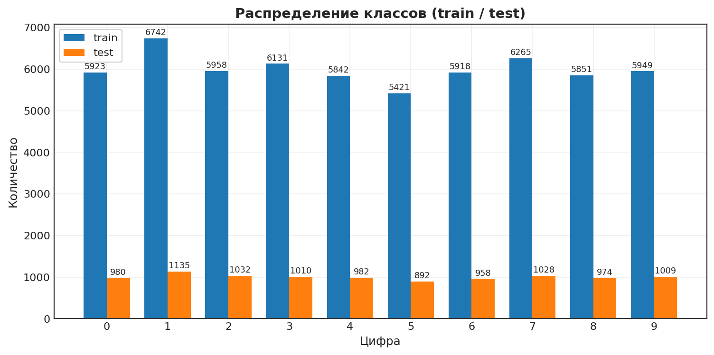
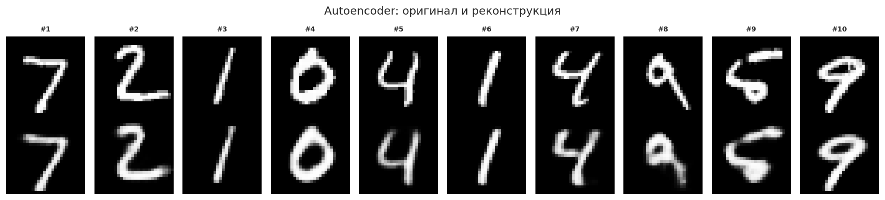
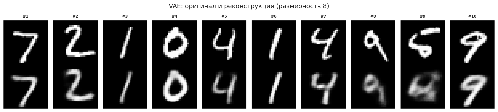
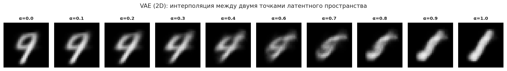
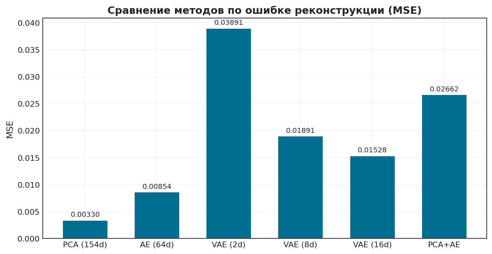
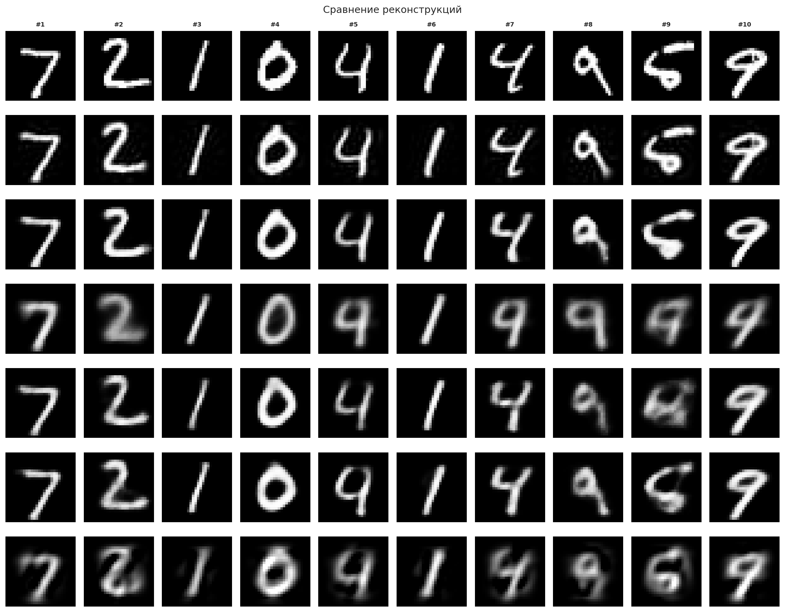
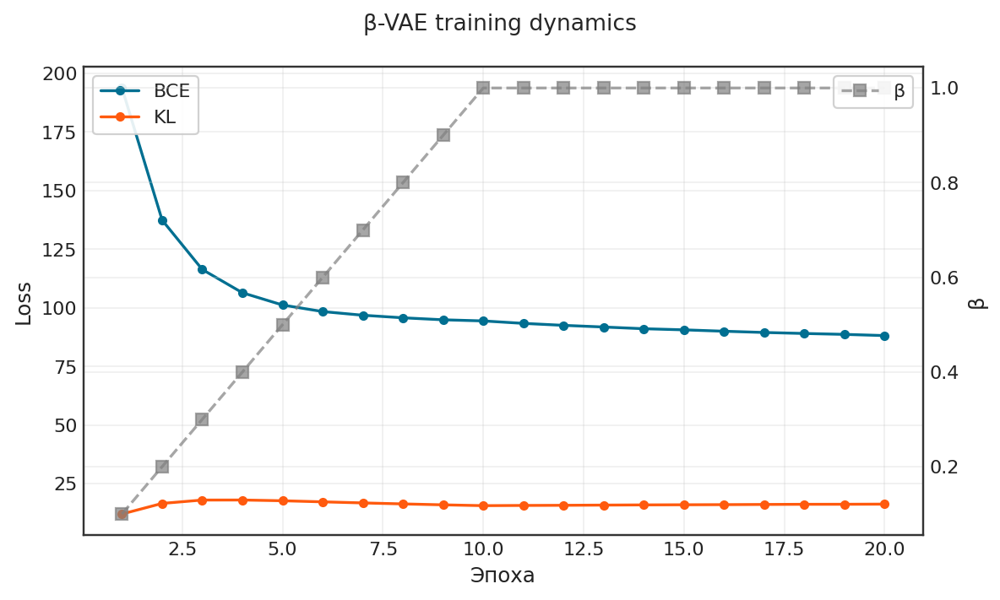
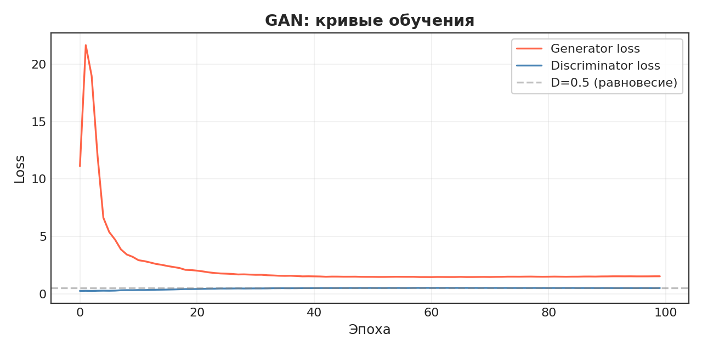
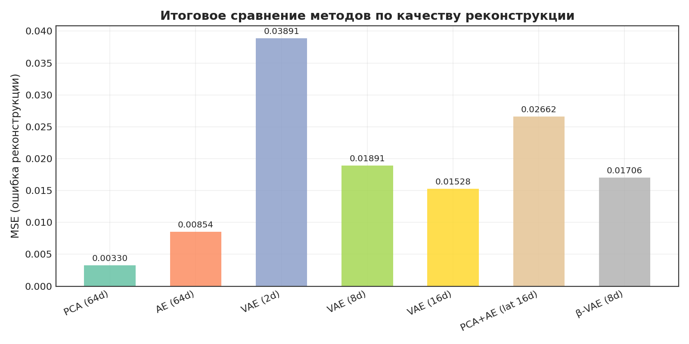

# Исследование методов генерации и понижения размерности на MNIST

Проект посвящён сравнительному анализу классических и современных подходов к снижению размерности и генеративному моделированию на примере набора рукописных цифр MNIST. Реализованы:
- **Автоэнкодер (AE)**
- **Вариационный автоэнкодер (VAE)** с перебором размерностей латентного пространства (2, 8, 16)
- **β‑VAE** с KL‑аннилингом
- **Генеративно‑состязательная сеть (GAN)**
- **Метод главных компонент (PCA)** с автоматическим подбором числа компонент для порога объяснённой дисперсии 95%
- Гибрид **PCA + AE**

Все эксперименты проводятся в едином пайплайне с кэшированием результатов, воспроизводимостью (seed) и сохранением графиков в `output/figures/`. Проект реализован на PyTorch.

---

## Структура проекта

```
.
├── config.py                # Все параметры (размерности, эпохи, пути и т.д.)
├── main.py                  # Точка входа – последовательный запуск шагов
├── pipeline.py              # Утилиты: стили графиков, сериализация, общие plot‑функции
├── step01_data_loader.py    # Загрузка MNIST, предпросмотр, распределение классов
├── step02_ae.py             # Обычный автоэнкодер (AE)
├── step03_vae.py            # Вариационный автоэнкодер (VAE) с перебором latent_dim
├── step04_generate.py       # Генерация и эксперименты для 2D VAE
├── step05_compare.py        # Сравнение PCA, AE, VAE, PCA+AE
├── step06_vae_improved.py   # Улучшенный β‑VAE с annealing
├── step07_gan.py            # Генеративно‑состязательная сеть (GAN)
├── step08_final_comparison.py # Итоговая сводка и визуализация
├── environment.yml          # Conda‑окружение с зависимостями
├── data/                    # Автоматически загружаемый набор MNIST
└── output/
    ├── cache/               # Кэш обученных моделей и массивов (.pkl, .npy)
    └── figures/             # Все графики (кривые обучения, реконструкции, сравнения)
```

---

## Теоретические основы

### Автоэнкодер (AE)
Автоэнкодер — нейросеть, обучающаяся восстанавливать входные данные после прохождения через «узкое горло» (bottleneck) — скрытое представление пониженной размерности. Архитектура состоит из энкодера (сжатие) и декодера (восстановление). Минимизация ошибки реконструкции (обычно бинарная кросс‑энтропия или MSE) заставляет модель выделять наиболее информативные признаки данных. AE не накладывает вероятностных ограничений на латентное пространство, поэтому случайная точка в этом пространстве не обязательно декодируется в осмысленное изображение.

### Вариационный автоэнкодер (VAE)
VAE расширяет идею AE, вводя вероятностную интерпретацию: энкодер выдаёт параметры нормального распределения (μ и log σ²) для латентного представления z. Вместо прямой передачи z используется **трюк репараметризации**: z = μ + ε·σ, ε ~ N(0,1). Это позволяет обучать модель методом обратного распространения. Функция потерь ELBO состоит из двух частей:
- **BCE / MSE** — ошибка реконструкции,
- **KL‑дивергенция** между апостериорным распределением Q(z|x) и априорным P(z) = N(0,1), что «разглаживает» латентное пространство.

Благодаря KL‑регуляризации всё латентное пространство становится «плотным»: любая точка, выбранная из N(0,1), при декодировании даёт реалистичное изображение.

### β‑VAE
Модификация VAE с увеличенным весом KL‑члена: L = BCE + β·KL. Повышение β способствует disentanglement — независимости отдельных измерений латентного пространства и улучшению интерпретируемости, но может ухудшить качество реконструкции.

### GAN (Generative Adversarial Network)
GAN состоит из двух сетей, обучающихся в антагонистической игре:
- **Генератор** преобразует случайный шум z в изображение,
- **Дискриминатор** оценивает, является ли изображение реальным (из обучающей выборки) или сгенерированным.

Цель генератора — «обмануть» дискриминатор, создавая неотличимые от настоящих образцы. GAN не имеет явной функции реконструкции, но часто даёт более чёткие изображения, чем VAE.

### PCA (метод главных компонент)
Линейный метод понижения размерности: данные проецируются на направления максимальной дисперсии. PCA не предполагает нелинейных зависимостей и не является генеративной моделью, но служит быстрым и интерпретируемым baseline.

---

## Пошаговое описание пайплайна

### Шаг 1: Загрузка и анализ данных

**Цель:** загрузить MNIST, нормализовать, изучить статистики и распределение классов.

**Реализация:** данные приводятся к диапазону [0, 1], строятся гистограммы распределения классов и примеры с аугментацией (вращение ±15°, сдвиг ±10%).

**Результаты:**
- Тренировочный набор: 60 000 изображений, тестовый: 10 000.
- Интенсивность пикселей: min=0.00, max=1.00, mean=0.1307, std=0.3081.
- Классы сбалансированы.

**Графики:**
- `01_class_distribution.png` — распределение классов.
- `01_data_preview.png` — примеры оригиналов и их аугментированных версий.



---

### Шаг 2: Автоэнкодер (AE)

**Цель:** обучить классический автоэнкодер и оценить качество реконструкции.

**Реализация:**
- Архитектура: вход 784 → 256 → 128 → 64 (latent code) → 128 → 256 → 784 (Sigmoid).
- Функция потерь: бинарная кросс‑энтропия (BCE).
- Обучение: 20 эпох, Adam(lr=1e‑3), batch_size=256.

**Результаты:**
- Кривая BCE плавно убывает от 210 до 69.2.
- MSE на тестовом наборе: **0.008536**.

**Графики:**
- `02_ae_loss_curve.png` — кривая обучения.
- `02_ae_reconstruction.png` — оригинал vs реконструкция AE.



---

### Шаг 3: Вариационный автоэнкодер (VAE) – множественные размерности

**Цель:** исследовать влияние размерности латентного пространства (2, 8, 16) на реконструкцию и генеративные способности.

**Реализация:**
- Архитектура аналогична AE, но энкодер выдаёт μ и log σ², применяется трюк репараметризации.
- Функция потерь: ELBO = BCE + KL.
- Для каждой размерности обучение 20 эпох, Adam(lr=1e‑3).

**Результаты:**

| Размерность | BCE (train, последняя эпоха) | KL (train) | MSE (test) |
|-------------|-----------------------------|-----------|------------|
| 2           | 137.95                      | 6.33      | 0.038928   |
| 8           | 93.69                       | 16.01     | 0.018880   |
| 16          | 84.82                       | 20.28     | 0.015277   |

С ростом размерности качество реконструкции улучшается (MSE падает), но KL‑дивергенция растёт — модель усложняет латентное пространство, отходя от строгой нормальности.

**Графики:**
- `03_vae_loss_curve_dim{2,8,16}.png` — кривые BCE и KL для каждой размерности.
- `03_vae_reconstruction_dim{2,8,16}.png` — реконструкции VAE.



---

### Шаг 4: Генеративные эксперименты с VAE (2D)

**Цель:** продемонстрировать генеративные возможности VAE с 2‑мерным латентным пространством.

**Реализация:**
- Случайная генерация из N(0,1).
- Интерполяция между двумя точками латентного пространства с шагом α ∈ [0,1].
- Построение сетки изображений в диапазоне z₁,z₂ ∈ [-3,3]².
- Эксперименты с аддитивным шумом в латентном пространстве (σ = 0, 0.5, 1.0, 2.0).

**Результаты:**
- Генерация из N(0,1) даёт разборчивые цифры, хотя иногда встречаются искажённые.
- Интерполяция плавная, подтверждая непрерывность латентного пространства.
- Сетка показывает постепенное изменение стиля цифр при перемещении в пространстве.
- Шум с σ=0.5 практически не портит изображения; σ=2.0 приводит к сильному размытию.

**Графики:**
- `04_random_generation.png` — сгенерированные цифры.
- `04_interpolation.png` — интерполяция.
- `04_latent_grid.png` — сетка латентного пространства.
- `04_noise_experiment.png` — влияние шума.



---

### Шаг 5: Сравнение PCA, AE, VAE и PCA+AE

**Цель:** количественно и визуально сравнить методы понижения размерности.

**Реализация:**
- **PCA:** автоматический подбор числа компонент для сохранения ≥95% дисперсии. Для MNIST потребовалось **154 компоненты** (из 784).
- **AE:** модель из шага 2 (64 латентных признака).
- **VAE:** модели из шага 3.
- **PCA+AE:** дополнительный AE на PCA‑сжатых данных (154→16) для проверки нелинейного улучшения.

**Результаты:**

| Метод            | Latent dim | MSE (test) | Объяснённая дисперсия |
| ---------------- | :--------: | :--------: | :-------------------: |
| PCA              | 154        | **0.003302** | 95.02%               |
| AE               | 64         | 0.008536   | —                    |
| VAE (2d)         | 2          | 0.038928   | —                    |
| VAE (8d)         | 8          | 0.018880   | —                    |
| VAE (16d)        | 16         | 0.015277   | —                    |
| PCA+AE           | 16         | 0.026102   | —                    |

**Анализ:**
- PCA с 154 компонентами значительно превосходит все остальные методы по MSE, но не обладает генеративными свойствами и линейно.
- AE (64d) лишь незначительно уступает PCA, но использует в 2.4 раза меньшую размерность.
- VAE закономерно жертвует качеством реконструкции ради генеративных возможностей: чем меньше размерность, тем хуже MSE, но тем лучше визуализация и интерполяция.
- PCA+AE показал себя хуже чистого PCA из‑за двойного сжатия и потери информации.

**Графики:**
- `05_pca_explained_variance.png` — накопленная объяснённая дисперсия PCA.
- `05_compare_mse.png` — столбчатая диаграмма MSE.
- `05_reconstruction_compare.png` — визуальное сравнение реконструкций (подписи содержат MSE).
- `05_latent_space_compare.png` — сравнение 2D латентных пространств PCA и VAE.




---

### Шаг 6: Улучшенный β‑VAE

**Цель:** улучшить структуру латентного пространства через более глубокую архитектуру и KL‑аннилинг.

**Реализация:**
- Энкодер: 784 → 512 (LayerNorm) → 256 (LayerNorm) → 128 → μ, log σ².
- Декодер: 8 → 128 → 256 → 512 → 784 (Sigmoid).
- KL‑аннилинг: β линейно возрастает от 0 до 1.0 за 10 эпох (β_max=1.0), затем фиксируется.
- Обучение: 20 эпох, Adam(lr=1e‑3), latent_dim=8.

**Результаты:**
- MSE на тесте: **0.017070**.
- BCE снизилась до ~88.2, KL стабилизировался около 16.3.
- По сравнению с обычным VAE (8d, MSE=0.018880) β‑VAE показал немного лучшую реконструкцию, но основное преимущество лежит в более развязанном (disentangled) латентном пространстве (визуализировано через PCA проекцию).

**Графики:**
- `06_training.png` — динамика BCE, KL и β.
- `06_generation.png` — случайная генерация β‑VAE.
- `06_latent_space.png` — проекция μ на 2D через PCA.
- `06_compare_all.png` — добавление β‑VAE к общему сравнению MSE.



---

### Шаг 7: GAN

**Цель:** реализовать генеративно‑состязательную сеть и сопоставить качество генерации с VAE.

**Реализация:**
- Генератор: z (64) → 128 → 256 → 784 (Sigmoid), с BatchNorm.
- Дискриминатор: 784 → 256 → 128 → 1 (Sigmoid), LeakyReLU(0.2).
- Стабилизация: label smoothing (реальные метки — 0.9), Adam (lr=2e‑4, β₁=0.5, β₂=0.999).
- Обучение: 100 эпох, batch_size=256.

**Результаты:**
- К концу обучения потери дискриминатора колеблются около **0.5142**, генератора — около 1.5369. D ≈ 0.5 указывает на достижение равновесия Нэша: дискриминатор не может отличить сгенерированные изображения от реальных лучше случайного угадывания.
- Генерация GAN субъективно чётче, чем у VAE, особенно для тонких линий цифр.

**Графики:**
- `07_gan_loss.png` — кривые обучения GAN.
- `07_gan_interpolation.png` — интерполяция в латентном пространстве GAN.



---

### Шаг 8: Итоговый анализ

**Цель:** собрать все метрики в единую сводку и провести финальное сравнение.

**Итоговая таблица методов (MSE на тестовой выборке, где применимо):**

| Метод               | Latent dim | MSE      | Генерация | Интерпретируемость       |
|---------------------|:----------:|:--------:|:---------:|--------------------------|
| PCA (154d)          | 154        | 0.003302 | Нет       | Высокая                  |
| AE (64d)            | 64         | 0.008536 | Нет       | Средняя                  |
| VAE (2d)            | 2          | 0.038928 | Да        | Высокая                  |
| VAE (8d)            | 8          | 0.018880 | Да        | Низкая                   |
| VAE (16d)           | 16         | 0.015277 | Да        | Низкая                   |
| PCA+AE (lat 16d)    | 16         | 0.026102 | Нет       | Средняя                  |
| β‑VAE (8d)          | 8          | 0.017070 | Да        | Средняя                  |
| GAN (64d)           | 64         | —        | Да        | Низкая                   |

**Выводы:**
- **PCA** с автоматически подобранными 154 компонентами обеспечивает наилучшую реконструкцию, но не является генеративной моделью.
- **AE (64d)** даёт сопоставимое качество при меньшей размерности, но не генерирует новые образцы.
- **VAE** успешно решает задачу генерации, и компромисс между качеством реконструкции и размерностью латентного пространства наглядно демонстрируется сравнением размерностей 2/8/16.
- **β‑VAE** незначительно улучшает MSE по сравнению с обычным VAE‑8d и способствует развязыванию факторов, однако эффект не всегда прямо коррелирует с MSE.
- **GAN** производит наиболее чёткие изображения без явной функции реконструкции; обучение стабильно, D‑loss ≈ 0.5.
- **PCA+AE** не оправдывает себя на MNIST: ошибка добавляется на этапе дополнительного сжатия, не компенсируясь нелинейностью.

**Общие рекомендации по выбору метода:**
- Нужна быстрая компрессия без генерации → **PCA**.
- Нужна нелинейная компрессия и восстановление → **AE**.
- Нужна генерация новых образцов с плавной интерполяцией и визуализацией латентного пространства → **VAE** (особенно с низкоразмерным латентным пространством).
- Требуется максимальная реалистичность сгенерированных изображений → **GAN**.
- Необходимо интерпретируемое и развязанное латентное представление → **β‑VAE**.

**Финальные графики:**
- `08_final_mse_comparison.png` — сводная столбчатая диаграмма MSE.
- `08_vae_vs_gan.png` — прямое сравнение образцов VAE (2d) и GAN.



---

## Инструкции по запуску

### Установка окружения
Рекомендуется использовать Conda. Для создания окружения выполните:
```bash
conda env create -f environment.yml
conda activate vae_env
```

### Запуск полного пайплайна
```bash
python main.py
```
Опции:
- `--show-plots` — показать графики в интерактивном режиме (по умолчанию только сохраняются в `output/figures/`).
- `--force-retrain` — игнорировать кэш и переобучить все модели заново.
- `--seed N` — установить seed для воспроизводимости (по умолчанию 42).

Пример с показом графиков и переобучением:
```bash
python main.py --show-plots --force-retrain
```

Все результаты (графики, обученные модели, метрики) будут сохранены в папке `output/`.